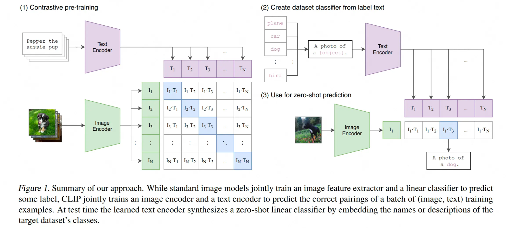
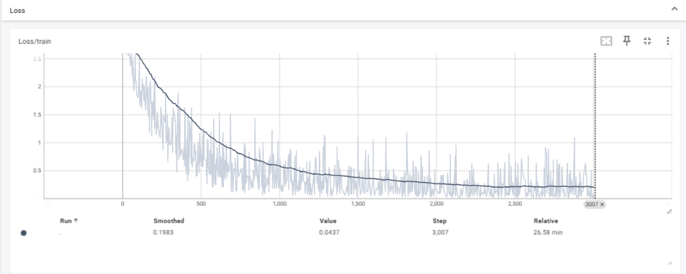

# clip_from_scratch

## Introduction

基于mnist手写数字训练的clip模型，用作学习多模态模型的用途，只能预测0-9

## Preliminary

- **CLIP**



- **pseudocode for the core of an implementation of CLIP**

```python
    def forward(**kwargs):
        r"""
        Perform CLIP training forward process
        Args:
            image_encoder - ResNet or Vision Transformer
            text_encoder - CBOW or Text Transformer
            I[n, h, w, c] - minibatch of aligned images
            T[n, l] - minibatch of aligned texts
            W_i[d_i, d_e] - learned proj of image to embed
            W_t[d_t, d_e] - learned proj of text to embed
            t - learned temperature parameter
            extract feature representations of each modality
        Return:
            loss
        """
        I_f = image_encoder(I) #[n, d_i]
        T_f = text_encoder(T) #[n, d_t]
        # joint multimodal embedding [n, d_e]
        I_e = l2_normalize(np.dot(I_f, W_i), axis=1)
        T_e = l2_normalize(np.dot(T_f, W_t), axis=1)
        # scaled pairwise cosine similarities [n, n]
        logits = np.dot(I_e, T_e.T) * np.exp(t)
        # symmetric loss function
        labels = np.arange(n)
        loss_i = cross_entropy_loss(logits, labels, axis=0)
        loss_t = cross_entropy_loss(logits, labels, axis=1)
        loss = (loss_i + loss_t)/2
        return loss
```
- **Loss**



## Acknowledgements

- [CV大模型系列之：多模态经典之作CLIP，探索图文结合的奥秘](https://juejin.cn/post/7264503343996747830)
- [CLIP](https://github.com/OpenAI/CLIP)
- [Learning Transferable Visual Models From Natural Language Supervision](https://arxiv.org/pdf/2103.00020)
- [mnist-clip](https://github.com/xinli2008?tab=repositories)
